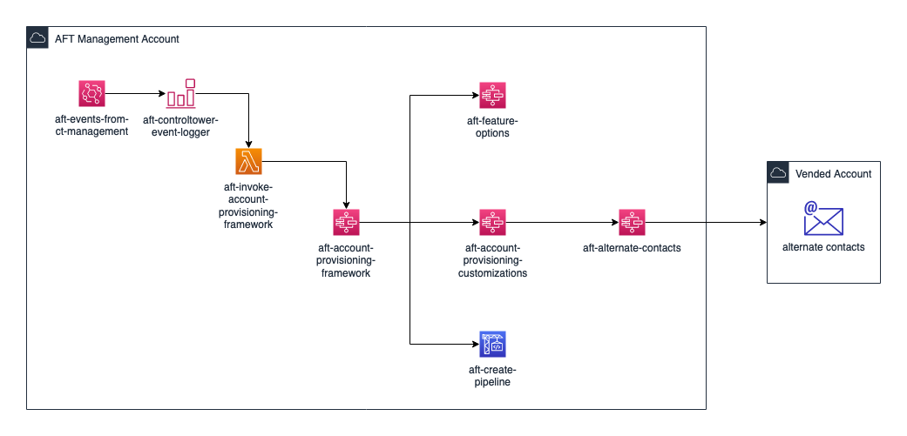
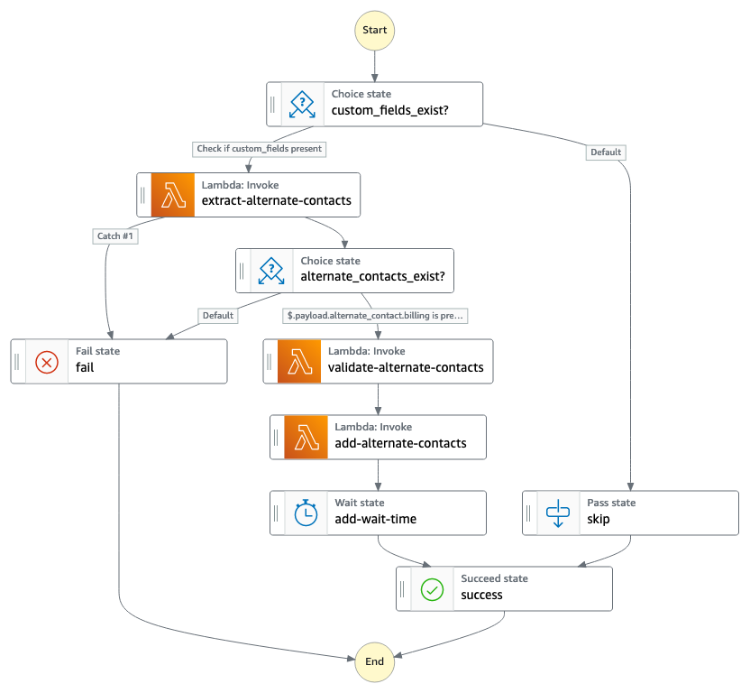

## aft-workshop-sample

Sample repository and customization for AWS Control Tower Account Factory for Terraform (AFT).

This repository is part of AFT lab. For detailed walkthrough, please check the lab in [AWS Control Tower Workshop](https://controltower.aws-management.tools/automation/).

## How to use 

There are four branches in this repository, navigate to each branch for more content. Refer to instruction on [AWS Control Tower Workshop](https://controltower.aws-management.tools/automation/) for detailed walkthrough.

## Branch: aft-alternate-contacts
This is a sample state machine that you can use inside `aft-account-provisioning-customizations`. 

## Description
This Terraform module implements state machine to update AWS account alternate contacts based on `custom_fields` parameter from `aft-account-requests` module. For implementation guidance, refer to the [AWS Control Tower workshop for AFT](https://controltower.aws-management.tools/automation/aft_custom).

### Sample usage
Sample of `custom_fields` implementation for `aft-alternate-contacts`:
```
module "vending_account_1" {
  source = "./modules/aft-account-request"
  ...
  custom_fields = {
    alternate_contact = jsonencode(
      {
        "billing"= {
          "email-address" = "billing@mycompany.com",
          "name"          = "Account Receiveable",
          "phone-number"  = "+11234567890",
          "title"         = "Billing Department"
        },
        "operations"= {
          "email-address" = "ops@mycompany.com",
          "name"          = "Operations 24/7",
          "phone-number"  = "+11234567890",
          "title"         = "DevOps Team"
        },
        "security"= {
          "email-address" = "soc@mycompany.com",
          "name"          = "Security Ops Center",
          "phone-number"  = "+11234567890",
          "title"         = "SOC Team"
        }
      }
    )
    another_custom_field1 = "a"
    another_custom_field1 = "b"
  }
  ...
}
```

### Overview

Diagram below depicts the invocation of `aft-alternate-contacts` as part of `aft-account-provisioning-customizations`. 


The **aft-alternate-contacts** state machine consist of three separate Lambda functions that extracts the custom fields, validate the contacts information using regex and then updates the alternate contact in the target account. 


## Requirements

This module requires [Account Factory for Terraform (AFT)](https://github.com/aws-ia/terraform-aws-control_tower_account_factory) and must be deployed as part of account provisioning customization. 

| Name | Version |
|------|---------|
| <a name="requirement_terraform"></a> [terraform](#requirement\_terraform) | >= 0.15.0 |
| <a name="requirement_aws"></a> [aws](#requirement\_aws) | >= 3.15 |

## Providers

| Name | Version |
|------|---------|
| <a name="provider_archive"></a> [archive](#provider\_archive) | n/a |
| <a name="provider_aws"></a> [aws](#provider\_aws) | n/a |

## Resources

| Name | Type |
|------|------|
| [aws_cloudwatch_log_group.aft_alternate_contacts_add_lambda_log](https://registry.terraform.io/providers/hashicorp/aws/latest/docs/resources/cloudwatch_log_group) | resource |
| [aws_cloudwatch_log_group.aft_alternate_contacts_extract_lambda_log](https://registry.terraform.io/providers/hashicorp/aws/latest/docs/resources/cloudwatch_log_group) | resource |
| [aws_cloudwatch_log_group.aft_alternate_contacts_validate_lambda_log](https://registry.terraform.io/providers/hashicorp/aws/latest/docs/resources/cloudwatch_log_group) | resource |
| [aws_iam_role.aft_alternate_contacts_add_lambda_role](https://registry.terraform.io/providers/hashicorp/aws/latest/docs/resources/iam_role) | resource |
| [aws_iam_role.aft_alternate_contacts_extract_lambda_role](https://registry.terraform.io/providers/hashicorp/aws/latest/docs/resources/iam_role) | resource |
| [aws_iam_role.aft_alternate_contacts_state_role](https://registry.terraform.io/providers/hashicorp/aws/latest/docs/resources/iam_role) | resource |
| [aws_iam_role.aft_alternate_contacts_validate_lambda_role](https://registry.terraform.io/providers/hashicorp/aws/latest/docs/resources/iam_role) | resource |
| [aws_iam_role_policy.aft_alternate_contacts_add_lambda_role_policy](https://registry.terraform.io/providers/hashicorp/aws/latest/docs/resources/iam_role_policy) | resource |
| [aws_iam_role_policy.aft_alternate_contacts_state_role_policy](https://registry.terraform.io/providers/hashicorp/aws/latest/docs/resources/iam_role_policy) | resource |
| [aws_iam_role_policy_attachment.aft_alternate_contacts_add_lambda_role_policy_attachment](https://registry.terraform.io/providers/hashicorp/aws/latest/docs/resources/iam_role_policy_attachment) | resource |
| [aws_iam_role_policy_attachment.aft_alternate_contacts_extract_lambda_role_policy_attachment](https://registry.terraform.io/providers/hashicorp/aws/latest/docs/resources/iam_role_policy_attachment) | resource |
| [aws_iam_role_policy_attachment.aft_alternate_contacts_validate_lambda_role_policy_attachment](https://registry.terraform.io/providers/hashicorp/aws/latest/docs/resources/iam_role_policy_attachment) | resource |
| [aws_lambda_function.aft_alternate_contacts_add_lambda](https://registry.terraform.io/providers/hashicorp/aws/latest/docs/resources/lambda_function) | resource |
| [aws_lambda_function.aft_alternate_contacts_extract_lambda](https://registry.terraform.io/providers/hashicorp/aws/latest/docs/resources/lambda_function) | resource |
| [aws_lambda_function.aft_alternate_contacts_validate_lambda](https://registry.terraform.io/providers/hashicorp/aws/latest/docs/resources/lambda_function) | resource |
| [aws_sfn_state_machine.aft_alternate_contacts_state](https://registry.terraform.io/providers/hashicorp/aws/latest/docs/resources/sfn_state_machine) | resource |
| [archive_file.aft_alternate_contacts_add](https://registry.terraform.io/providers/hashicorp/archive/latest/docs/data-sources/file) | data source |
| [archive_file.aft_alternate_contacts_extract](https://registry.terraform.io/providers/hashicorp/archive/latest/docs/data-sources/file) | data source |
| [archive_file.aft_alternate_contacts_validate](https://registry.terraform.io/providers/hashicorp/archive/latest/docs/data-sources/file) | data source |
| [aws_caller_identity.aft_management_id](https://registry.terraform.io/providers/hashicorp/aws/latest/docs/data-sources/caller_identity) | data source |
| [aws_dynamodb_table.aft_request_metadata_table](https://registry.terraform.io/providers/hashicorp/aws/latest/docs/data-sources/dynamodb_table) | data source |
| [aws_iam_policy.AWSLambdaBasicExecutionRole](https://registry.terraform.io/providers/hashicorp/aws/latest/docs/data-sources/iam_policy) | data source |
| [aws_region.aft_management_region](https://registry.terraform.io/providers/hashicorp/aws/latest/docs/data-sources/region) | data source |
| [aws_ssm_parameter.aft_request_metadata_table_name](https://registry.terraform.io/providers/hashicorp/aws/latest/docs/data-sources/ssm_parameter) | data source |

## Inputs

| Name | Description | Type | Default | Required |
|------|-------------|------|---------|:--------:|
| <a name="input_aws_ct_mgt_account_id"></a> [aws\_ct\_mgt\_account\_id](#input\_aws\_ct\_mgt\_account\_id) | Control Tower Management Account Id | `string` | n/a | yes |
| <a name="input_aws_ct_mgt_org_id"></a> [aws\_ct\_mgt\_org\_id](#input\_aws\_ct\_mgt\_org\_id) | Control Tower Organization Id | `string` | n/a | yes |
| <a name="input_cloudwatch_log_group_retention"></a> [cloudwatch\_log\_group\_retention](#input\_cloudwatch\_log\_group\_retention) | Lambda CloudWatch log group retention period | `string` | `"0"` | no |

## Outputs

| Name | Description |
|------|-------------|
| <a name="output_aft_alternate_contacts_add_lambda_arn"></a> [aft\_alternate\_contacts\_add\_lambda\_arn](#output\_aft\_alternate\_contacts\_add\_lambda\_arn) | aft-alternate-contacts-add Lambda ARN |
| <a name="output_aft_alternate_contacts_extract_lambda_arn"></a> [aft\_alternate\_contacts\_extract\_lambda\_arn](#output\_aft\_alternate\_contacts\_extract\_lambda\_arn) | aft-alternate-contacts-extract Lambda ARN |
| <a name="output_aft_alternate_contacts_state_machine_arn"></a> [aft\_alternate\_contacts\_state\_machine\_arn](#output\_aft\_alternate\_contacts\_state\_machine\_arn) | State machine ARN |
| <a name="output_aft_alternate_contacts_validate_lambda_arn"></a> [aft\_alternate\_contacts\_validate\_lambda\_arn](#output\_aft\_alternate\_contacts\_validate\_lambda\_arn) | aft-alternate-contacts-validate Lambda ARN |
<!-- END_TF_DOCS -->

## Security

See [CONTRIBUTING](CONTRIBUTING.md#security-issue-notifications) for more information.

## License

This library is licensed under the MIT-0 License. See the LICENSE file.

